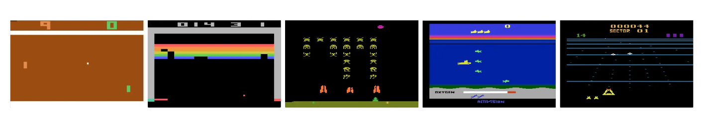
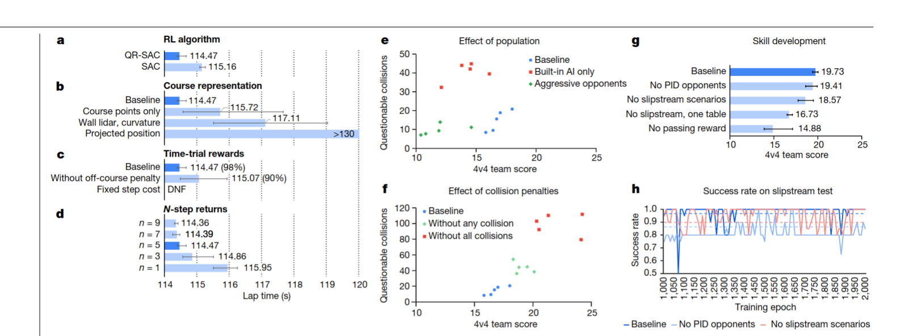
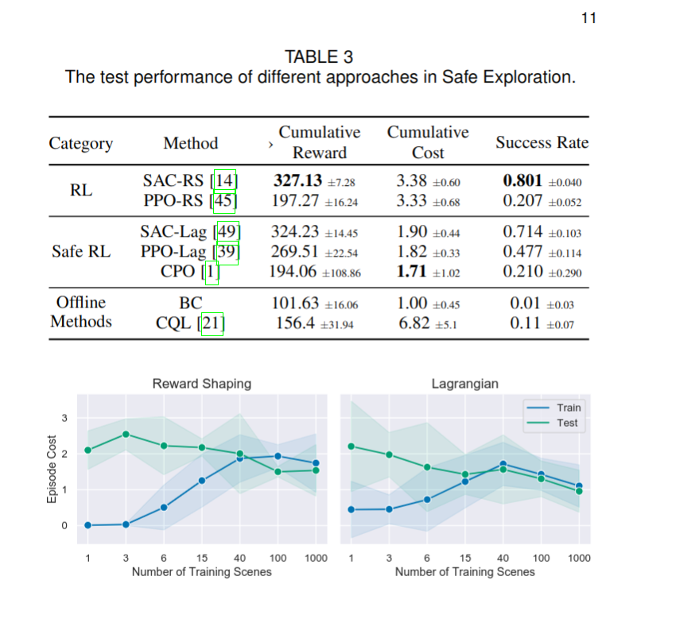
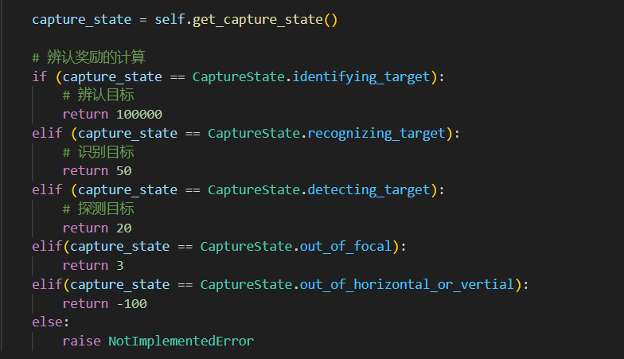
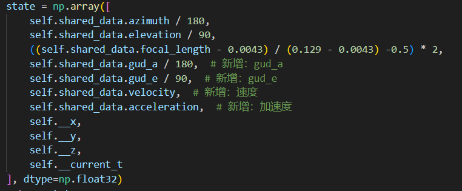
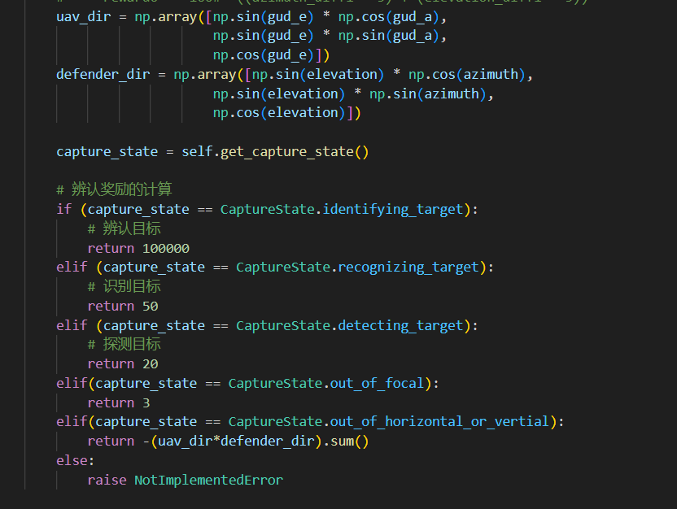

# rl-program

Input：
- guide info (2,)
- camera info (3,)

Output:
- da,de,df

Feature:
- noise

break into :
1. frame buffer, to get the capture state -> flag to judge identifacation
2. noise guidance infomation  -> clear one

# Issuse
强化学习在其中扮演的角色
- 输入guid info
- 输出角度，焦距的增量

## 如何评估一个agent的performance
现有中，评估一个agent的performance来自于计算一个episode的得分，而这个得分，在现有的程序中即为reward，如下面的`total_reward`
```
for episode in range(max_episodes):
    observation = env.reset()
    total_reward = 0
    done = False

    while not done:
        #print(f"{observation}")
        action = agent.select_action(observation)
        #print(f"{action}")
        next_observation, reward, done, _ = env.step(action)
        agent.buffer.push(observation, action, reward, next_observation, done)
        total_reward += reward

        observation = next_observation
        # SAC算法中的训练步骤
        for i in range(3):
            agent.update_parameters(agent.buffer, 1024, updates)
            updates += 1  # 每次更新后递增更新次数

    episode_rewards.append(total_reward)
    print(f"Episode: {episode + 1}, Total Reward: {total_reward}")
```
这种设计是否合理？

目前的情况是，随着我对奖励函数进行调整，total_reward会发生变化，相当于前后模型用的不同的性能评价指标。

其他一些经典的环境，往往奖励函数都是固定的且得到公认的，因此不同论文在这上面做实验，可以把`total_reward`当作性能评价指标。

而在我们这种还处于**环境搭建**阶段，是不是找到另外一种不变量更为合理，比如用了多少步才找到uav

## 性能表现不佳的情况下，首先从哪方面找原因
在我看来，强化学习项目最主要的是agent的**架构设计**和**环境的奖励设计**。
### agent的架构
从原始的policy gradient，到PPO，或者actor critic到SAC，SAC++，还有其他各种算法，通常考虑模型如何更好地优化。因此，他们的性能评价往往是在多个环境上进行测试。

- PG->PPO 增加重要性采样，可以重用过去的trajectory
- PG->AC 增加critic模型，减少方差
- AC->SAC 增加entropy概念，鼓励模型进行探索
- SAC->SAC++ 调整为duel Q架构，自动调整SAC中的temperature 超参数
这些模型的性能评价中，大多数是在atri的50多个游戏环境中进行实验。也并没有说100%超越，会存在个别游戏环境不如前者，比如SAC->SAC++

### 环境的奖励设计
一些新的环境在发表论文时，工程向的论文

# Issue
## 如何评估模型性能
目前采用的评估方式是计算每个episode的`total_reward`，这意味着，调整环境的奖励函数会使得前后评价指标不一致。
```
for episode in range(max_episodes):
    observation = env.reset()
    total_reward = 0
    done = False

    while not done:
        #print(f"{observation}")
        action = agent.select_action(observation)
        #print(f"{action}")
        next_observation, reward, done, _ = env.step(action)
        agent.buffer.push(observation, action, reward, next_observation, done)
        total_reward += reward

        observation = next_observation
        # SAC算法中的训练步骤
        qf1_loss, qf2_loss, policy_loss, alpha_loss, alpha = agent.update_parameters(agent.buffer, 1024, updates)
        updates += 1  # 每次更新后递增更新次数

    episode_rewards.append(total_reward)
    print(f"Episode: {episode + 1}, Total Reward: {total_reward}")
```

我认为：常用环境中之所以采用reward作为评价指标，是因为他们的奖励函数是得到公认的，比如Ataria游戏环境。


而对于我们这种奖励函数还处于**设计阶段**，选择某个**不变量**作为评价指标更加靠谱，比如从探测目标到发现目标用了多少步。

#

## 性能不佳的情况下，优先考虑哪方面的问题
搭建一个强化学习项目，主要涉及到两部分：
- agent的架构设计
  - 如何建模$\text{action} = F_{\theta}(\text{observation})$
  - **如何优化**$\theta$
- 环境的设计
  - 设计对应的交互接口（输出observation，接受action）
  - **奖励机制**  - 

一些学术向的文献，往往聚焦在**如何优化$\theta$**，他们的实验，也都是比较新模型在不同环境下的表现，比如：
- PG->PPO：添加重要性采用，提升样本利用率，实现类似off-policy机制
- PG->AC: 添加critic架构，减小方差
- AC->SAC: 添加entropy约束，鼓励模型探索新动作
- SAC->SAC++： 添加duel Q架构，去除SAC中的超参数temperature

但是这里并没有银弹，也就是说不存在通用解法，比如SAC和SAC++，50多个Atari实验环境中，也并不是100%占优

此外，一些工程性文章则考虑直接拿某个算法来用



更多是这个环境下，奖励函数的设计。

这两着都会决定模型的表现。**但是，在模型完全不work的情况下，需要首先关注哪个呢?**

没有收敛，哪怕飞机停在空中不动，不添加任何噪音
<video controls>
    <source src="assets/20231130_172237.mp4" type="video/mp4">
</video>

<details><summary>具体奖励函数</summary>



</details>

尝试归一化环境的observation
<video controls>
    <source src="assets/sac2.mp4" type="video/mp4">
</video>

<details><summary>改动</summary>



</details>

尝试调整奖励函数
<video controls>
    <source src="assets/sac3.mp4" type="video/mp4">
</video>

<details><summary>改动</summary>



</details>


换成PPO
<video controls>
    <source src="assets/ppo.mp4" type="video/mp4">
</video>


# 奖励函数的设计
1. 人的数据作为奖励
2. 短时间覆盖的空间，没任何信息的时候，鼓励
cos 参数稀疏设置max

收集有无引导信息的专家数据。